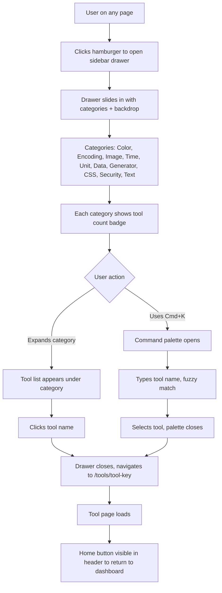

# UX Design Specification csr-dev-tools

**Author:** csrteam
**Date:** 2026-02-12

---

## Executive Summary

### Project Vision

CSR Dev Tools is a free, open-source, 100% client-side developer toolkit — one bookmark replacing dozens of scattered, ad-ridden, paywall-gated utility websites. Every tool runs entirely in the browser with zero server communication, zero tracking, and zero cost. The architecture is the philosophy: if a tool needs a server, it doesn't belong here.

The product is a shipped MVP (6 tools live) expanding toward 60+ tools across 8 categories. The UX must scale gracefully from a small toolkit to a comprehensive developer utility platform while maintaining instant usability and zero-friction access.

### Target Users

One universal persona — no segmentation, no tiers. Anyone with a browser is a first-class user.

**Primary archetype: "The Frustrated Tool Hunter"** — developers, designers, students, DevOps engineers, and freelancers who routinely need quick-access utilities and are tired of ads, tracking, usage limits, and subscription paywalls.

**Journey archetypes informing UX decisions:**

- **First-Timer** — arrives via search for a specific tool, completes task instantly, discovers more tools, bookmarks
- **Repeat User** — returns by muscle memory, navigates directly to tools, uses multiple tools per session
- **Mobile User** — needs a tool on-the-go, expects a first-class touch experience, not a degraded desktop layout
- **Contributor** — follows clear patterns to build and submit new tools via open-source workflow

### Key Design Challenges

1. **Scalable tool discovery** — Dashboard must grow from 6 to 60+ tools without sacrificing glanceability. Requires search, filtering, and categorization that scale gracefully.
2. **Interaction consistency across diverse tools** — Simple converters and complex multi-step tools (diff checker, regex tester, image cropper) must feel like one cohesive product family.
3. **Mobile-first for power-tool UIs** — Complex interactions (color pickers, code formatters, diff viewers) must be genuinely usable at 375px, not just technically responsive.
4. **Zero-onboarding self-explanatory UI** — Every tool must be instantly usable through clear labels, smart placeholders, and intuitive affordances alone.

### Design Opportunities

1. **Speed as a felt UX feature** — Zero server round-trips enables real-time, live-preview interactions. Instant feedback on every input is a differentiator users viscerally feel.
2. **Trust through visual clarity** — The ad-free, distraction-free, clutter-free interface is itself the trust signal. Clean design communicates the privacy-first values without needing to say it.
3. **Delightful micro-interactions** — Motion animations on copy confirmations, conversions, uploads, and transitions make the experience feel crafted and premium — differentiating from the "functional but ugly" competitors.

## Core User Experience

### Defining Experience

The core experience is the **single-tool loop**: arrive at a tool, provide input, get output, take the result. Every UX decision serves this loop. The platform exists to make this loop as fast and frictionless as possible — for any tool, on any device, for any user.

**The loop:** Input (paste/type/upload) → Instant processing (no server, no loading) → Output (copy/download) → Done.

If the single-tool experience is fast, clear, and satisfying, the platform succeeds. Dashboard, navigation, theming, and discovery are all in service of getting users into and through this loop with zero friction.

### Platform Strategy

- **Web-only SPA** — no native apps, no browser extensions, no CLI. One URL, any device, any browser.
- **Desktop primary, mobile first-class** — most usage will be desktop (developers at work), but mobile must be genuinely usable, not a compromised layout.
- **Input modes** — mouse/keyboard on desktop, touch on mobile. No device-specific APIs beyond standard browser capabilities (Canvas, Clipboard, File API).
- **Static hosting** — deployable anywhere (Vercel, Netlify, GitHub Pages). No server runtime, no environment variables.
- **Dark theme only** — developers expect it. The space/universe visual identity is inherently dark. No light theme variant.
- **Offline potential** — service worker for offline access is a future consideration, not a current requirement.

### Effortless Interactions

1. **Instant output** — for simple conversions (color, encoding, units, timestamps), output appears as the user types. No "Convert" button needed. Complex tools (image processing, diff) use an explicit action button but show results immediately after.
2. **One-action output capture** — single click to copy result to clipboard or download a file. No intermediate modals, no format selection dialogs for the common case.
3. **Direct URL access** — every tool is reachable by URL. Users arriving from search land directly on the tool, ready to use. No homepage detour, no onboarding interstitial.
4. **Prevention over error handling** — impossible states are prevented by design. Constrain inputs, disable invalid options, use smart defaults. Error messages are a last resort, not a primary feedback mechanism.
5. **Smart defaults** — every tool loads with sensible defaults already set. The user can start immediately without configuring anything.

### Critical Success Moments

1. **The 3-second win** — the user arrives, provides input, and has their result in under 3 seconds of thinking time. This is the moment that earns the bookmark.
2. **The "wait, it does that too?" discovery** — while using one tool, the user notices others. This converts a single-use search visitor into a repeat user.
3. **The trust confirmation** — the absence of friction (no cookie banner, no signup wall, no ads, no "upgrade to pro") is itself the trust moment. Users feel it by what's NOT there.
4. **The copy-paste success** — the user copies the output, pastes it into their code/tool, and it works. Output formatting must be precise and developer-ready (no trailing whitespace, correct casing, valid syntax).

### Experience Principles

1. **Tool-first, platform-second** — every design decision serves the single-tool loop. Platform chrome (header, sidebar, navigation) stays minimal and out of the way. The tool IS the page.
2. **Instant over interactive** — prefer live, real-time output over multi-step wizards. If the browser can show the result as the user types, it should. Eliminate unnecessary confirmation steps.
3. **Obvious over clever** — no hidden gestures, no "discover by hovering," no progressive disclosure of basic functionality. Every input and output is visible and labeled. The UI teaches itself.
4. **Quiet confidence** — the product earns trust through restraint. No marketing banners, no social proof widgets, no "share this tool" popups. The clean, focused interface is the value proposition made visible.

## Desired Emotional Response

### Primary Emotional Goals

1. **Relief** — "Finally, something that just works." The dominant first-visit emotion. After bouncing between ad-ridden, paywall-gated tools, the user feels an exhale. No cookie banner. No signup. No limits. Just the tool.
2. **Confidence** — "I know exactly what to do." The UI is so clear the user never hesitates. Inputs are obvious, outputs are immediate, actions are labeled. No guessing, no anxiety.
3. **Efficiency** — "That was fast." The task is done before the user expected it to be. Client-side speed + zero navigation friction creates effortless productivity.
4. **Trust** — "I can come back here." Built through consistency — works the same every time, nothing gated, no dark patterns. The user stops looking for alternatives.

### Emotional Journey Mapping

| Stage | Desired Feeling | UX Driver |
|-------|----------------|-----------|
| First discovery | Surprise + relief | No barriers, clean interface, instant access |
| First use | Confidence + speed | Self-explanatory UI, instant output |
| Task completion | Satisfaction + efficiency | One-click copy/download, precise output |
| Tool exploration | Curiosity + delight | Discovering more tools, consistent quality |
| Return visit | Comfort + trust | Same experience, no degradation, no new friction |
| Error/edge case | Calm + guided | Prevention over error messages, graceful fallbacks |

### Micro-Emotions

**Cultivate:**
- **Confidence over confusion** — every interaction is self-evident. The user always knows what to do next.
- **Trust over skepticism** — open source, no tracking, no monetization signals. Nothing to be suspicious about.
- **Accomplishment over frustration** — tasks complete successfully on the first attempt through smart defaults and input constraints.
- **Delight over mere satisfaction** — subtle animations, instant feedback, and crafted details elevate "it works" to "this is nice."

**Prevent:**
- **Suspicion** — "What's the catch?" Eliminated by zero tracking, open source code, no monetization of any kind.
- **Overwhelm** — "Too many options." Prevented by smart defaults, clean layouts, and progressive tool discovery as the library grows.
- **Uncertainty** — "Did it work?" Eliminated by instant visible output, clear success states, and copy/download confirmations.

### Design Implications

| Emotional Goal | UX Design Approach |
|---------------|-------------------|
| Relief | Strip away everything competitors add: no banners, no modals, no cookie walls, no signup prompts. The absence of friction IS the design. |
| Confidence | Visible labels on every input/output. Smart placeholders showing expected format. Disabled states for invalid options. No hidden functionality. |
| Efficiency | Real-time output as user types. One-click copy with visual confirmation (toast). No unnecessary intermediate steps or confirmation dialogs. |
| Trust | Consistent behavior across all tools. No surprises between visits. Open source badge visible but not pushy. Zero data collection signals. |
| Delight | Motion animations on state changes (copy success, format conversion, file upload). Smooth transitions between tools. Polished micro-interactions that feel crafted. |
| Calm (on error) | Prevent errors by design first. When unavoidable, use inline non-blocking messages. Never modal error dialogs. Never blame the user. |

### Emotional Design Principles

1. **Subtract to add emotion** — removing friction (ads, banners, signup, limits) creates more emotional impact than adding features. Every element removed is trust earned.
2. **Speed is a feeling** — instant output doesn't just save time, it creates a visceral sense of power and efficiency. Perceived speed matters as much as actual speed.
3. **Consistency builds trust unconsciously** — when every tool behaves predictably (same input patterns, same output locations, same copy behavior), users stop thinking and start trusting.
4. **Delight through craft, not novelty** — animations and polish should feel inevitable, not gimmicky. A smooth copy confirmation toast is delightful. A confetti animation is not.

## UX Pattern Analysis & Inspiration

### Inspiring Products Analysis

**VS Code** — the developer's daily driver
- Command Palette: universal search/action pattern that scales to hundreds of commands without cluttering the UI. One shortcut, find anything.
- Minimal chrome: editor workspace dominates. Sidebars, panels, and menus collapse and stay out of the way. The work IS the interface.
- Sensible defaults: works perfectly out of the box. Zero configuration needed to be productive. Power users customize later.
- Consistent patterns: tabs, inputs, panels, and keyboard shortcuts behave identically across all contexts. Learn once, apply everywhere.

**Figma** — proof that browser-native can be world-class
- Real-time feedback: every action produces immediate visual response. No spinners, no "processing" states for common operations.
- Restrained visual design: neutral, muted UI chrome that never competes with the user's content. The tool disappears; the work takes center stage.
- Free that feels free: the free tier is the real product, not a crippled demo. Users never feel punished or limited.
- Professional quality in a browser: shatters the assumption that browser tools are inferior to native apps.

**Developer utility sites (CyberChef, IT-Tools, transform.tools)** — the competitive landscape
- Functional but not delightful: they solve the problem but feel like afterthoughts. No craft, no personality, no reason to prefer one over another.
- Visually cluttered: CyberChef's recipe system is powerful but overwhelming. IT-Tools is generic. Most look dated.
- Poor mobile: nearly all are desktop-only or barely responsive. Mobile is an afterthought.
- Inconsistent tool UX: each tool feels like a different mini-app bolted together rather than a cohesive product.

### Transferable UX Patterns

**Navigation Patterns:**
- **Command Palette / Quick Search** (from VS Code) — as the tool library grows beyond 10, a keyboard-triggered search overlay (`Cmd+K` / `Ctrl+K`) lets power users jump directly to any tool by name. Scales infinitely without adding visual clutter.
- **Minimal persistent navigation** (from VS Code + Figma) — keep the header/nav bar thin and unobtrusive. The tool workspace should dominate the viewport. Navigation is there when needed, invisible when not.

**Interaction Patterns:**
- **Real-time preview** (from Figma) — every input change produces instant visual output. No "submit" step for simple conversions. The output area is always live.
- **Consistent input/output layout** (from VS Code) — every tool follows the same spatial pattern: input on one side/top, output on the other side/bottom. Users learn the layout once and it transfers to every tool.
- **Copy-to-clipboard with confirmation** (universal pattern) — single click copies, brief toast confirms. No modal, no extra step.

**Visual Patterns:**
- **Neutral, muted chrome** (from Figma) — UI elements use subdued colors so user content (color values, code, images) stands out. The interface serves the content, not itself.
- **Dark-only design** — dark theme with careful contrast ratios. No light theme variant — the space/universe identity commits fully to dark.

### Anti-Patterns to Avoid

1. **CyberChef's complexity wall** — powerful recipe/chaining system that overwhelms first-time users. CSR Dev Tools keeps each tool standalone and self-contained. No chaining, no pipeline building.
2. **IT-Tools' generic feel** — technically functional but visually forgettable. No personality, no craft. CSR Dev Tools should feel polished and intentional.
3. **Ad-supported tool sites' dark patterns** — fake download buttons, cookie consent walls, "free trial" bait, interstitial ads. CSR Dev Tools defines itself by the absence of all this.
4. **Desktop-only layouts** — competitors treat mobile as an afterthought. CSR Dev Tools treats mobile as a first-class citizen.
5. **Inconsistent tool behavior** — when every tool has different input methods, different button placements, different output handling, users must re-learn the interface for each tool. CSR Dev Tools enforces consistent patterns.

### Design Inspiration Strategy

**Adopt:**
- VS Code's Command Palette pattern for scalable tool discovery (`Cmd+K`)
- Figma's real-time feedback philosophy — instant output on every input change
- VS Code's minimal chrome approach — tool workspace dominates, platform UI stays thin
- Consistent spatial layout across all tools (input region → output region → action buttons)

**Adapt:**
- VS Code's sidebar navigation → simplified for a tool dashboard (category filtering, not a file tree)
- Figma's restrained palette → adapted for a developer utility context (monospace typography cues, code-friendly color choices)

**Avoid:**
- CyberChef's complexity and visual density
- Generic "Bootstrap admin template" aesthetic common in IT-Tools and similar
- Any pattern that requires learning before using (progressive disclosure of advanced features is fine; hiding basic functionality is not)
- Any monetization-adjacent patterns (even "star us on GitHub" popups — let the quality speak)

## Design System Foundation

### Design System Choice

**Custom-assembled themeable system** built on Radix UI + Tailwind CSS v4 + tailwind-variants — already established in the existing codebase.

This is not an off-the-shelf design system (MUI, Chakra, Ant Design). It's a purpose-built component layer assembled from best-in-class primitives: Radix for accessible behavior, Tailwind for styling, tailwind-variants for typed component APIs, and Motion for animations.

### Rationale for Selection

1. **Already proven** — the existing 6-tool MVP runs on this stack. The foundation works. The task is formalization, not replacement.
2. **Accessibility by default** — Radix UI provides WCAG 2.1 AA-compliant primitives (focus management, keyboard navigation, ARIA attributes) without custom implementation effort.
3. **Zero bundle overhead** — no monolithic UI framework. Each component includes only what it needs. Adding tools doesn't bloat the initial bundle.
4. **Contributor-friendly** — Tailwind utilities + tailwind-variants patterns are widely known. Contributors don't need to learn a proprietary component API.
5. **Full visual control** — no fighting framework opinions. Every pixel is intentional, every interaction is custom-crafted. The product looks like itself, not like "a Material Design app."

### Implementation Approach

**Existing primitives (Radix UI):**
- Dialog, Select, Tabs, Toast — use as-is, style with Tailwind
- Add new Radix primitives as needed (Popover, Tooltip, Toggle, etc.)

**Existing custom components:**
- Button, Card, TextInput, TextAreaInput, SelectInput, UploadInput, FieldForm, DataCellTable, ProgressBar, Tabs, Dialog, ToastProvider
- All use `tv()` wrapper from `@/utils` for typed variant definitions

**Component variant pattern:**
- Define `CompVariant<T>` typed variants object above each component
- Use `tv()` from `@/utils` (not directly from tailwind-variants)
- oxfmt automatically sorts Tailwind classes inside `tv()` calls

**Motion animations:**
- Import from `motion/react`
- Use `motion.div`, `motion.button` with `whileHover`, `whileTap`, `initial`, `animate` props
- Animations are polish, not gating — never block user flow

### Customization Strategy

**Formalization priorities for scaling from 6 to 60+ tools:**

1. **Standardized tool layout template** — define a consistent spatial structure every tool follows:
   - Tool header (title + one-line description)
   - Input region (top or left)
   - Output region (bottom or right)
   - Action bar (copy, download, reset buttons in consistent positions)
   - Mobile: stack vertically (input → output → actions)

2. **Shared interaction components** — extract and formalize reusable tool-level components:
   - CopyButton (with toast confirmation)
   - DownloadButton (with format/filename)
   - FileUploadZone (drag-and-drop + click, with format constraints)
   - ResetButton (clear inputs and outputs)
   - OutputDisplay (formatted result with copy affordance)

3. **Design tokens via Tailwind v4 `@theme`** — centralize in `src/index.css`:
   - Color palette (dark-only — no light theme variant)
   - Spacing scale (consistent padding/margins across tools)
   - Typography scale (monospace for code values, sans-serif for UI)
   - Border radius, shadow, and transition tokens
   - Breakpoints (375px mobile, 768px tablet, 1024px desktop)

4. **Documented component patterns** — enable contributors to build tools that look native:
   - "Adding a new tool" guide references exact components to use
   - Variant options documented per component
   - Layout template enforced by convention and example

## Defining Experience

### The Core Interaction

> **"Paste something in, get the result instantly, copy it out."**

The entire product distills to this single loop. A developer has a value — a hex color, a base64 string, a timestamp, an image — and needs it in a different form. They paste/type/drop it in, see the result immediately, take it and go. Every design decision, every component, every animation serves this loop.

If a user can describe CSR Dev Tools to a colleague, it should be: "You paste something in and get the result. No signup, no ads, no limits."

### User Mental Model

**How users think about this task:**
- "I have input X, I need output Y" — that's the entire mental model. Users think in terms of transformation, not features or settings.
- Each tool is a simple transformer: input goes in one side, output comes out the other.
- Users expect the experience to feel like a calculator — type input, see result. No ceremony.

**Mental model users bring from existing solutions:**
- Search Google → click a random site → dismiss cookie banner → fight through ads → find the input field → paste → click "Convert" → find the output → copy it → leave and never return
- This trained behavior means users will be *pleasantly surprised* when steps are missing. The absence of friction IS the differentiator.

**Where existing solutions break the mental model:**
- Force a "Convert" button click (unnecessary gate between input and output)
- Show ads between input and output (breaks visual flow and focus)
- Require account creation before showing results (blocks the loop entirely)
- Output in formats that don't paste cleanly into code (breaks the last mile)
- Usage limits that interrupt mid-workflow ("you've used 3 of 5 free conversions today")

### Success Criteria

**The core interaction succeeds when:**

1. **Input is obvious** — the user immediately knows where to paste/type/upload. No scanning, no scrolling, no "where do I start?"
2. **Output is instant** — for text-based tools, results appear as the user types. For file-based tools, results appear within 1-2 seconds of action. No loading spinners for simple conversions.
3. **Output is precise** — copied values paste correctly into code. No trailing whitespace, no incorrect casing, no extra formatting. The output IS the value the developer needs.
4. **Exit is one click** — copy to clipboard or download to device in a single action. Toast confirms success. Done.
5. **The whole loop takes under 5 seconds** — from landing on the tool to having the result in their clipboard. If it takes longer, something is wrong.

**Success indicators:**
- User completes task without scrolling (tool fits viewport)
- User never asks "how do I use this?" (UI is self-teaching)
- User copies output on first attempt (formatting is correct)
- User bookmarks the site (value was clear enough to return)

### Novel UX Patterns

**Pattern classification: 100% established patterns, innovating through execution quality.**

No novel interaction design is needed. The toolkit uses universally understood patterns:
- Text input fields (paste/type)
- File upload zones (drag-and-drop/click)
- Formatted output display (read-only, copy-ready)
- Action buttons (copy, download, reset)
- Select dropdowns (format choice, options)
- Tabs (mode switching within a tool)

**The innovation is subtraction, not addition:**
- No "Convert" button for simple transforms (output is live)
- No signup wall (tool is immediately usable)
- No ads or banners (100% of viewport is tool)
- No usage limits (unlimited, forever)
- No server processing indicator (there is no server)

**One elevated pattern — Command Palette for tool discovery:**
- As the library scales, `Cmd+K` / `Ctrl+K` opens a search overlay to jump to any tool by name
- Borrowed from VS Code — familiar to the target audience
- Not novel, but elevated: instant fuzzy search across all tools with keyboard-first navigation

### Experience Mechanics

**1. Initiation:**
- **Direct URL** — user arrives at a specific tool via search or bookmark (e.g., `/tools/color-converter`). Tool is immediately ready.
- **Dashboard** — user arrives at home, scans tool cards, clicks one. Card expands or navigates to the tool.
- **Command Palette** — user presses `Cmd+K`, types tool name, hits Enter. Instant navigation.

**2. Interaction:**
- **Text tools** — user types or pastes into input field. Output updates in real-time as they type. No submit button.
- **File tools** — user drags a file onto the upload zone (or clicks to browse). Processing begins automatically. Progress shown if needed.
- **Option tools** — user adjusts settings (format dropdown, quality slider, dimension inputs) and sees output update live or after pressing an action button.

**3. Feedback:**
- **Real-time output** — the output region updates as the user interacts. This IS the primary feedback. The user sees their result forming.
- **Copy confirmation** — toast notification appears briefly ("Copied to clipboard") with a check icon. Auto-dismisses in 2-3 seconds.
- **Download confirmation** — file downloads to device via browser download. Toast confirms.
- **Error prevention** — invalid inputs are constrained (disabled options, input masks, format hints). If an error occurs, inline message appears below the input — never a modal.

**4. Completion:**
- **The user knows they're done** when the output matches what they need. There is no "submit" or "finalize" step.
- **Successful outcome** — the value is in their clipboard or the file is on their device.
- **What's next** — nothing. The tool stays ready for another conversion. Or the user discovers another tool via the dashboard or Command Palette.

## Visual Design Foundation

### Theme Identity

**Space/Universe + 32-bit (subtle)** — a cosmic developer toolkit that feels like a control panel aboard a spacecraft. Deep space blacks, nebula purples and magentas, retro-futuristic typography. The 32-bit influence is felt in color saturation and crisp edges, not literal pixel art.

### Color System

All colors use OKLCH color space for perceptual uniformity.

**Brand Colors:**

| Token | Value | Description |
|-------|-------|-------------|
| `--color-primary` | `oklch(0.55 0.22 310)` | Cosmic magenta-purple — primary actions, focus states, active borders |
| `--color-secondary` | `oklch(0.65 0.12 260)` | Nebula blue-violet — secondary accents, hover states, supporting elements |

**Neutral Scale (cool-tinted):**

Grays shifted from pure neutral (hue 0) to a cool space-blue tint (hue 270, very low chroma) so the entire interface feels like it exists in deep space, not in a generic dark mode.

| Token | Value |
|-------|-------|
| `--color-white` | `oklch(0.98 0.005 270)` |
| `--color-black` | `oklch(0.02 0.005 270)` |
| `--color-gray-50` | `oklch(0.95 0.008 270)` |
| `--color-gray-100` | `oklch(0.9 0.008 270)` |
| `--color-gray-200` | `oklch(0.85 0.008 270)` |
| `--color-gray-300` | `oklch(0.75 0.008 270)` |
| `--color-gray-400` | `oklch(0.65 0.008 270)` |
| `--color-gray-500` | `oklch(0.55 0.008 270)` |
| `--color-gray-600` | `oklch(0.45 0.008 270)` |
| `--color-gray-700` | `oklch(0.35 0.008 270)` |
| `--color-gray-800` | `oklch(0.25 0.008 270)` |
| `--color-gray-900` | `oklch(0.15 0.008 270)` |
| `--color-gray-950` | `oklch(0.08 0.008 270)` |

**Semantic Colors (space-flavored):**

| Token | Value | Description |
|-------|-------|-------------|
| `--color-info` | `oklch(0.6 0.15 240)` | Deep space blue — informational states |
| `--color-warning` | `oklch(0.75 0.15 85)` | Distant star gold — warning states |
| `--color-success` | `oklch(0.65 0.18 165)` | Aurora teal — success states |
| `--color-error` | `oklch(0.6 0.2 15)` | Mars red — error states |

**Background Gradient (fully cool):**

```css
background-image: linear-gradient(
  to bottom,
  oklch(0 0 0) 0%,              /* Deep space void */
  oklch(0.1 0.03 270) 40%,      /* Barely perceptible midnight blue */
  oklch(0.15 0.06 285) 70%,     /* Deep space purple */
  oklch(0.2 0.1 300) 85%,       /* Nebula purple */
  oklch(0.28 0.14 310) 95%,     /* Distant nebula magenta */
  oklch(0.35 0.16 315) 100%     /* Nebula edge glow */
);
```

### Typography System

**Font Family:** Space Mono (Google Fonts) — monospace everywhere.

Retro-futuristic, quirky personality. The name reinforces the space theme. Monospace for everything signals "developer tool" and creates a unified, distinctive identity. Works at all sizes with good hinting.

```css
font-family: 'Space Mono', monospace;
```

**Type Scale (unchanged from existing — already well-defined):**

| Token | Size | Weight | Use |
|-------|------|--------|-----|
| heading-1 | 2.25rem / 2.5rem | 700 | Page titles |
| heading-2 | 1.875rem / 2.25rem | 600 | Section headers |
| heading-3 | 1.5rem / 2rem | 600 | Tool titles |
| heading-4 | 1.25rem / 1.75rem | 500 | Sub-sections |
| heading-5 | 1.125rem / 1.75rem | 500 | Labels |
| heading-6 | 1rem / 1.5rem | 500 | Small labels |
| body | 1rem / 1.5rem | 400 | Default text |
| body-sm | 0.875rem / 1.25rem | 400 | Secondary text, hints |
| body-xs | 0.75rem / 1rem | 400 | Captions, metadata |

Letter-spacing: 0.025em across all sizes (consistent with monospace readability).

### Spacing & Layout Foundation

**Base unit:** 4px (Tailwind default) — dense and efficient for a developer tool. Tools should feel compact and information-rich, not airy and spacious.

**32-bit subtle influence on spacing:**
- Slightly tighter padding within components (tools feel compact like a game UI)
- Consistent gaps between elements (8px, 12px, 16px, 24px primary steps)
- No excessive whitespace — every pixel earns its place

**Breakpoints:**

| Token | Value | Target |
|-------|-------|--------|
| mobile | default (0px+) | 375px minimum viewport |
| tablet | 48rem (768px) | Tablets, small laptops |
| laptop | 80rem (1280px) | Standard desktop |
| desktop | 120rem (1920px) | Large displays |

**Layout principles:**
- Tool workspace dominates viewport — minimal header/nav chrome
- Single-column on mobile, flexible multi-column on desktop
- Tool cards on dashboard use CSS Grid for responsive reflow
- Safe area insets respected for mobile notch handling

**32-bit subtle influence on shapes:**
- Border radius: slightly reduced — `4px` for small elements, `6px` for cards/containers (not fully squared, but crisper than the 8-12px common in modern UI)
- Borders: `1px` solid, defined edges — not soft/diffuse
- Shadows: tighter, more defined — less spread, more depth (like layered sprites)

**Shadow scale (adjusted for crisper, 32-bit feel):**

| Token | Value |
|-------|-------|
| `--shadow-sm` | `0 1px 2px oklch(0 0 270 / 0.15)` |
| `--shadow-md` | `0 2px 4px oklch(0 0 270 / 0.2)` |
| `--shadow-lg` | `0 4px 8px oklch(0 0 270 / 0.25)` |
| `--shadow-xl` | `0 8px 16px oklch(0 0 270 / 0.3)` |

### Accessibility Considerations

**Contrast compliance (WCAG 2.1 AA):**
- Primary text (white on dark bg): contrast ratio > 15:1 — exceeds AA
- Primary accent on dark bg: `oklch(0.55 0.22 310)` against `oklch(0.02 ...)` — verify 4.5:1 minimum for interactive elements
- Secondary accent: `oklch(0.65 0.12 260)` — verify 4.5:1 for text usage
- Semantic colors: all designed at lightness 0.6+ to ensure visibility on dark backgrounds
- Gray-400+ used for any text on dark backgrounds (lightness >= 0.65)

**Color independence:**
- No information conveyed by color alone — always paired with icons, labels, or patterns
- Focus states use border change (primary color) + shadow, not just color shift
- Error/success/warning states include text labels, not just color indicators

**Space Mono accessibility:**
- Monospace improves readability for code values and developer content
- 0.025em letter-spacing aids character distinction
- Minimum body-sm (0.875rem / 14px) — no text smaller than this in the interface

## Design Direction Decision

### Design Directions Explored

Six design directions were generated and evaluated (see `ux-design-directions.html` for visual reference):

1. **"Mission Control"** — Dense dashboard grid with command palette
2. **"Space Station"** — Persistent sidebar navigation
3. **"Observatory"** — Full-page tools, maximum workspace
4. **"Nebula Grid"** — Visual card gallery with modal tools
5. **"Terminal"** — Ultra-minimal CLI aesthetic
6. **"Constellation"** — Hybrid search + inline expansion

### Chosen Direction

**Enhanced Current Layout** — the existing drag-and-drop card grid dashboard + collapsible sidebar for tool navigation.

This direction preserves what already works (personalized card grid) while adding scalable tool discovery (categorized sidebar) for growth from 6 to 60+ tools.

**Dashboard (main area):**
- Card grid showing all tools — users drag-and-drop to personalize their layout
- Persistent layout preferences saved across sessions (existing `usePersistFeatureLayout`)
- Tools expand/operate within their cards (current behavior)
- Responsive grid: multi-column on desktop, single-column on mobile

**Sidebar (drawer overlay):**
- **All viewports**: drawer overlay that slides in from the left, toggled via hamburger icon in the header. Floats on top of content with a dark backdrop. Never pushes content.
- **Desktop**: drawer takes ~240-280px width with backdrop behind it.
- **Mobile**: drawer takes full-screen width with backdrop behind it.
- **Content**: tools grouped by category (Color, Encoding, Image, Time, Unit, Data, Generator, CSS, Security, Text). Each category is collapsible/expandable. Tool count badge per category.
- **Behavior**: clicking a tool in the sidebar navigates to its dedicated page at `/tools/{tool-key}` and auto-closes the drawer on all viewports.

**Header (minimal):**
- Left: hamburger toggle (sidebar) + home button (ArrowIcon + 🏠 emoji, visible on tool pages `/tools/*` only, navigates back to `/` via TanStack Router `<Link>`)
- Right: optional Command Palette trigger (`Cmd+K`)
- Thin (`h-12`), stays out of the way — tool-first, platform-second principle

**Tool page layout:**
- Tool component wrapped in existing `Card` component (same as homepage cards)
- Card centered horizontally with `max-w-[768px]`
- Card title shows tool name via `Card`'s title bar

**Root layout:**
- `#root` uses `h-dvh overflow-hidden` (not `min-h-dvh`) to constrain to exact viewport height
- `main` uses `grow overflow-y-auto` to scroll within remaining space below header
- Home page card height: `50dvh - 3.75rem` per row (accounts for header 3rem + padding 3rem + gap 1.5rem)

### Design Rationale

1. **Preserves proven UX** — the existing card grid with drag-and-drop is already shipped and working. Users already have personalized layouts. No need to rebuild what works.
2. **Scales gracefully** — the sidebar provides categorized access to the full tool library as it grows. At 6 tools, the sidebar is nice-to-have. At 60 tools, it's essential.
3. **Sidebar is additive, not disruptive** — collapsible means it's invisible by default. The dashboard remains the primary interface. The sidebar is a discovery mechanism, not a navigation requirement.
4. **Consistent with the "tool-first" principle** — the tool cards dominate the viewport. The sidebar and header stay minimal and out of the way.
5. **Mobile-appropriate** — hamburger menu on mobile is a well-understood pattern. The card grid stacks naturally into a single column. No complex navigation needed.

### Implementation Approach

**New components needed:**
- `Sidebar` — collapsible panel with category groups
- `SidebarCategory` — expandable group showing tool list
- `SidebarToolItem` — individual tool link within a category
- `HamburgerButton` — toggle for sidebar open/close

**State management:**
- Sidebar open/close state in a Zustand store
- Sidebar category expand/collapse state (default-all-expanded)
- Same drawer overlay behavior on all viewports

**Layout structure:**
```
#root (h-dvh overflow-hidden flex flex-col)
├── header (h-12 shrink-0): hamburger | home (← 🏠, tool pages only) | ... Cmd+K
├── Sidebar (fixed z-50 drawer overlay, slides from left when hamburger tapped)
│   ├── Backdrop (fixed inset-0 z-40 bg-black/50 backdrop-blur-sm)
│   └── Nav panel (fixed left, mobile: w-full, desktop: w-[260px])
└── main (grow overflow-y-auto)
    ├── TwinkleStarsAnimate (background)
    └── Outlet
        ├── HomePage: card grid (6 cards, 50dvh-3.75rem per row on laptop)
        └── ToolPage: Card component centered at max-w-[768px]
```

**Integration with existing code:**
- Header component updated to include hamburger toggle + conditional home button
- Sidebar renders as drawer overlay on all viewports — never affects main content layout
- Existing card grid, drag-and-drop, and `usePersistFeatureLayout` remain unchanged
- Tool categories derived from `TOOL_REGISTRY`
- Clicking a tool navigates to `/tools/{tool-key}` (Story 1.2 routes)

## User Journey Flows

### Journey 1: First-Timer Discovery (Kai)

**Goal:** Developer searches for a specific tool, finds csr-dev-tools, completes task, discovers more tools, bookmarks.

**Entry points:** Google search result (direct tool URL or homepage)


**Key UX moments:**
- Zero friction on landing — no banner, no signup, no cookie wall
- Tool is immediately usable (smart defaults, visible input field)
- Output appears as user types — no "Convert" button needed
- Copy is one click with toast confirmation
- Other tools visible on the same dashboard — passive discovery
- Bookmark is earned by the experience, not prompted

---

### Journey 2: Repeat User Multi-Tool (Priya)

**Goal:** Return user navigates to a specific tool quickly, uses multiple tools in one session, leverages sidebar for discovery.

**Entry point:** Browser bookmark

```mermaid
flowchart TD
    A[Opens csr-dev-tools bookmark] --> B[Dashboard loads with personalized layout]
    B --> C{Needs JWT Decoder}
    C -->|Visible on dashboard| D[Clicks card — navigates to /tools/jwt-decoder]
    C -->|Not visible| E[Opens sidebar drawer via hamburger]
    E --> F[Browses Encoding category]
    F --> G[Clicks JWT Decoder]
    G --> H[Drawer closes, navigates to /tools/jwt-decoder]
    H --> D
    D --> I[Pastes JWT token]
    I --> J[Header + payload decoded instantly]
    J --> K[Spots expiry timestamp in payload]
    K --> L[Opens sidebar drawer]
    L --> M[Clicks Unix Timestamp under Time category]
    M --> N[Drawer closes, navigates to /tools/unix-timestamp]
    N --> O[Pastes timestamp, sees human-readable date]
    O --> P[Bug found — token expired 3 hours ago]
    P --> Q[Clicks home button to return to dashboard]
```



**Key UX moments:**
- Dashboard loads with user's personalized layout (persisted drag-and-drop order)
- Sidebar drawer enables cross-tool navigation by routing to dedicated tool pages
- Category grouping helps users find tools by domain, not by memorized name
- Multi-tool workflow is seamless — sidebar drawer available from any page
- Home button in header provides quick return to dashboard from any tool page

---

### Journey 3: Mobile User (Marco)

**Goal:** Developer on phone needs to resize an image quickly between meetings.

**Entry point:** Phone browser (bookmark or direct URL)

```mermaid
flowchart TD
    A[Opens csr-dev-tools on phone browser] --> B[Dashboard: single-column card stack]
    B --> C{Needs Image Resize}
    C -->|Scrolls to card| D[Taps Image Resize card]
    C -->|Too many cards| E[Taps hamburger menu]
    E --> F[Sidebar drawer: categories listed]
    F --> G[Taps Image category]
    G --> H[Taps Image Resize]
    H --> I[Drawer closes, navigates to /tools/image-resizer]
    I --> D
    D --> J[Taps upload zone]
    J --> K[Phone gallery opens, selects image]
    K --> L[Image loads, dimensions shown]
    L --> M[Enters target dimensions]
    M --> N[Taps Resize button]
    N --> O[Progress bar, then download ready]
    O --> P[Taps Download — file saves to phone]
    P --> Q[Toast: 'Image resized and downloaded']
```



**Key UX moments:**
- Single-column layout on mobile — cards stack naturally
- Hamburger menu provides full tool access without cluttering the mobile viewport
- Sidebar opens as full-screen drawer overlay — focused navigation, then closes and navigates to tool page
- File upload works via phone gallery (native file picker)
- All processing is on-device — works on cellular, no upload to server
- Download triggers native browser download behavior
- Touch targets: 44x44px minimum for all interactive elements

---

### Journey 4: Tool Discovery via Sidebar

**Goal:** User explores the tool library to find new tools they didn't know existed.

**Entry point:** Hamburger toggle or `Cmd+K` Command Palette



**Key UX moments:**
- Sidebar drawer categories give structure to a large tool library
- Tool count badges show library depth at a glance
- Expandable categories reduce visual overwhelm — users drill into what interests them
- Command Palette (`Cmd+K`) provides instant keyboard-first access for power users
- Drawer auto-closes on all viewports after tool selection — clean transition to tool page
- Home button in header provides quick return to dashboard from any tool page

---

### Journey Patterns

**Navigation patterns (consistent across all journeys):**
- **Dashboard-first**: every journey starts or returns to the card grid dashboard
- **Sidebar-assisted**: sidebar is a discovery and navigation aid, never a requirement
- **Command Palette shortcut**: `Cmd+K` / `Ctrl+K` available everywhere for instant tool access
- **Direct URL**: every tool is reachable by URL for search engine and bookmark entry

**Interaction patterns (consistent across all tools):**
- **Input → Instant output**: text tools show results as user types; file tools process on action
- **One-click capture**: copy to clipboard or download — single action, toast confirmation
- **Smart defaults**: every tool loads ready to use with sensible default values
- **Prevention over error**: invalid inputs constrained by design, not caught by error messages

**Feedback patterns (consistent across all states):**
- **Toast notifications**: brief, auto-dismissing confirmations for copy/download/success
- **Inline errors**: non-blocking, below the input, never modal
- **Progress indicators**: for file operations only (image resize, convert) — never for text operations
- **Route transition**: smooth navigation to tool page when selecting via sidebar or Command Palette

### Flow Optimization Principles

1. **Minimize steps to value** — every flow is designed so the user reaches their result in the fewest possible interactions. No intermediate screens, no setup wizards, no confirmation dialogs.
2. **Parallel paths, same destination** — users can reach any tool via dashboard scan, sidebar browse, Command Palette search, or direct URL. All paths lead to the same tool experience.
3. **Mobile flows mirror desktop** — same journey steps, adapted layout. Mobile doesn't lose functionality, just rearranges spatially.
4. **Sidebar is optional** — every journey works without the sidebar. It enhances discovery and navigation but is never a gate. At 6 tools, users may never open it. At 60 tools, it becomes essential.
5. **Recovery is invisible** — error states are prevented by design. When unavoidable, recovery is inline and non-disruptive. The user never needs to "start over."

## Component Strategy

### Design System Components (Existing)

**Foundation layer — Radix UI primitives (unstyled, accessible):**
- Dialog, Select, Tabs, Toast — used as-is, styled with Tailwind

**Application layer — custom components built on Radix + Tailwind + tailwind-variants:**

| Component | Location | Purpose | Status |
|-----------|----------|---------|--------|
| `Button` | `common/button/` | Primary action trigger with motion animations | Complete |
| `Card` | `common/card/` | Tool container card with drag-and-drop support | Complete |
| `Dialog` | `common/dialog/` | Radix-based modal overlay | Complete |
| `TextInput` | `common/input/` | Single-line text input | Complete |
| `TextAreaInput` | `common/input/` | Multi-line text input | Complete |
| `SelectInput` | `common/input/` | Radix-based select dropdown | Complete |
| `UploadInput` | `common/input/` | File upload with drag-and-drop zone | Complete |
| `FieldForm` | `common/form/` | Label + input wrapper component | Complete |
| `DataCellTable` | `common/table/` | Key-value pair display table | Complete |
| `Tabs` | `common/tabs/` | Radix-based tab navigation | Complete |
| `ToastProvider` | `common/toast/` | Global toast notifications (Radix + Zustand) | Complete |
| `ProgressBar` | `common/progress-bar/` | Animated progress indicator | Complete |
| `TwinkleStarsAnimate` | `common/animate/` | Background star animation | Complete |
| `NotoEmoji` | `common/emoji/` | Emoji font renderer | Complete |
| Icons (13) | `common/icon/` | SVG icons: Copy, Download, Upload, Trash, etc. | Complete |

**Assessment:** Strong foundation for the existing 6 tools. Gaps emerge from the new design direction (sidebar, command palette) and formalization needs (standardized tool layout, reusable output patterns).

### Custom Components (New)

#### Sidebar System

**`Sidebar`**
- **Purpose:** Drawer overlay navigation panel showing all tools grouped by category
- **Anatomy:** Header (close button) → Search filter (optional) → Category groups → Footer
- **States:** collapsed (hidden), expanded (visible), transitioning (animating in/out)
- **Variants:** desktop (drawer overlay, ~240-280px with backdrop) | mobile (full-screen drawer overlay with backdrop)
- **Accessibility:** `nav` landmark, `aria-label="Tool navigation"`, focus trapped when open on all viewports, `Escape` key closes
- **Interaction:** hamburger toggle opens/closes; click backdrop closes on all viewports; smooth slide animation via Motion

**`SidebarCategory`**
- **Purpose:** Expandable group within sidebar showing tools in a category
- **Anatomy:** Category label + tool count badge + expand/collapse chevron → tool list (when expanded)
- **States:** collapsed (shows label + count only), expanded (shows tool list)
- **Variants:** none — consistent across all categories
- **Accessibility:** `button` role on header for expand/collapse, `aria-expanded` state, `aria-controls` linking to tool list
- **Interaction:** click header to toggle expand/collapse; all categories default expanded on first load

**`SidebarToolItem`**
- **Purpose:** Individual tool link within a category group
- **Anatomy:** Tool emoji/icon + tool name
- **States:** default, hover (highlight), active (currently selected tool)
- **Accessibility:** `a` or `button` role, `aria-current="true"` when active
- **Interaction:** click navigates to `/tools/{tool-key}` page; drawer auto-closes on all viewports after navigation

**`HamburgerButton`**
- **Purpose:** Toggle for sidebar open/close state
- **Anatomy:** Three-line hamburger icon → X icon (when sidebar open)
- **States:** closed (hamburger icon), open (X icon), transitioning (animating between)
- **Accessibility:** `aria-label="Open navigation"` / `"Close navigation"`, `aria-expanded` state
- **Interaction:** click toggles sidebar; icon morphs between hamburger and X via Motion

#### Command Palette

**`CommandPalette`**
- **Purpose:** Keyboard-triggered search overlay for instant tool navigation
- **Anatomy:** Backdrop overlay → search input (auto-focused) → filtered results list → keyboard hint footer
- **States:** closed (hidden), open (visible with empty input), filtering (showing matched results), selected (result highlighted)
- **Variants:** none — single consistent implementation
- **Accessibility:** `role="dialog"`, `aria-modal="true"`, `aria-label="Search tools"`, focus trapped, `Escape` closes, arrow keys navigate results, `Enter` selects
- **Interaction:** `Cmd+K` / `Ctrl+K` opens; type to fuzzy-filter tools by name; arrow keys to navigate; `Enter` to select and close; `Escape` to dismiss
- **Content:** shows tool emoji + tool name + category tag for each result

**`SearchInput`**
- **Purpose:** Search field within Command Palette (and potentially sidebar)
- **Anatomy:** Search icon + text input + clear button (when text present) + keyboard shortcut hint
- **States:** empty (placeholder visible), typing (value + clear button), no results
- **Accessibility:** `role="combobox"`, `aria-autocomplete="list"`, `aria-controls` linked to results list
- **Interaction:** auto-focus on palette open; real-time filtering as user types; clear button resets

#### Tool Layout Components

**`ToolLayout`**
- **Purpose:** Standardized wrapper ensuring every tool follows the same spatial structure
- **Anatomy:** Tool header (title + description) → input region → output region → action bar
- **States:** idle (ready for input), processing (for file tools — shows progress), complete (output ready)
- **Variants:** `text` (input/output side-by-side or stacked) | `file` (upload zone + output + download) | `visual` (live preview tools like color picker, box shadow)
- **Accessibility:** `section` with `aria-label` matching tool name, logical tab order through input → output → actions
- **Interaction:** provides consistent structure; individual tools fill in their specific inputs/outputs within the regions
- **Mobile:** always stacks vertically (input → output → actions)

**`CopyButton`**
- **Purpose:** Specialized button that copies a value to clipboard and shows toast confirmation
- **Anatomy:** Copy icon + optional label ("Copy") → transforms to check icon briefly on success
- **States:** default (copy icon), copying (brief check icon + toast trigger), disabled (nothing to copy)
- **Variants:** `icon-only` (compact, for inline use next to output values) | `labeled` (with "Copy" text, for action bars)
- **Accessibility:** `aria-label="Copy [value description] to clipboard"`, announces "Copied" to screen readers via toast
- **Interaction:** click copies associated value to clipboard; triggers toast "Copied to clipboard"; icon briefly shows check mark then reverts

**`OutputDisplay`**
- **Purpose:** Formatted read-only output area with integrated copy affordance
- **Anatomy:** Output label + formatted value + CopyButton (inline)
- **States:** empty (placeholder/dashes), populated (value displayed), updated (brief highlight flash when value changes)
- **Variants:** `single` (one value, e.g., "rgb(59, 130, 246)") | `table` (multiple key-value pairs, e.g., color converter showing HEX, RGB, HSL) | `code` (monospace block, e.g., JSON output)
- **Accessibility:** `aria-live="polite"` announces value changes to screen readers, `aria-label` describes the output
- **Interaction:** value updates in real-time as input changes; CopyButton adjacent to each copyable value; brief highlight animation on value change (Motion)

**`CategoryBadge`**
- **Purpose:** Displays tool count within a sidebar category
- **Anatomy:** Rounded pill with number
- **States:** default (showing count)
- **Variants:** none — consistent small pill
- **Accessibility:** `aria-label="N tools"` for screen readers

### Component Implementation Strategy

**Build order (driven by user journey criticality):**

**Phase 1 — Core (enables the chosen design direction):**
1. `HamburgerButton` — required for sidebar toggle
2. `Sidebar` + `SidebarCategory` + `SidebarToolItem` + `CategoryBadge` — the entire sidebar system
3. `ToolLayout` — standardized tool wrapper (refactor existing tools to use it)

**Phase 2 — Enhancement (improves quality and consistency):**
4. `CopyButton` — extract from repeated patterns across tools
5. `OutputDisplay` — standardize output rendering across all tools
6. `CommandPalette` + `SearchInput` — keyboard-first tool discovery

**Phase 3 — Scaling (supports 60+ tools):**
7. Additional Radix primitives as needed (Tooltip, Popover, Toggle)
8. New icon components for additional tool categories
9. Potential `ToolCard` variant for compact grid at scale

**Implementation rules:**
- All new components follow existing patterns: named exports, `tv()` variants, types in `src/types/`, barrel exports
- Radix primitives used for any component with complex accessibility needs (sidebar could use Radix `NavigationMenu` or be custom)
- Motion used for all animations (sidebar slide, palette fade, button morphs)
- Every component gets a typed `CompVariant<T>` definition
- Mobile behavior defined for every component (not an afterthought)

## UX Consistency Patterns

### Feedback Patterns

**Copy-to-clipboard feedback:**
- **Trigger:** user clicks CopyButton or any copy action
- **Visual:** CopyButton icon morphs from clipboard → check mark (300ms), reverts after 2s
- **Toast:** "Copied to clipboard" with check icon, auto-dismisses in 2.5s, bottom-right position
- **Screen reader:** toast announced via `aria-live="polite"`
- **Mobile:** identical behavior, toast positioned above bottom safe area

**Download feedback:**
- **Trigger:** user clicks DownloadButton
- **Visual:** browser native download initiated, toast confirms
- **Toast:** "Downloaded [filename]" with download icon, auto-dismisses in 2.5s
- **Error:** if download fails, toast with error styling: "Download failed — try again"

**Processing feedback (file tools only):**
- **Trigger:** image resize, image convert, or any operation taking >300ms
- **Visual:** ProgressBar appears in the tool's output region, animated fill
- **Duration:** shown only when processing exceeds 300ms (no flash for fast operations)
- **Completion:** progress bar fills to 100%, then fades out, output appears
- **Never used for:** text conversions, encoding, color conversion — these are instant

**Success feedback:**
- **Pattern:** output region updates with new value + brief highlight flash (200ms background pulse via Motion)
- **No modal:** never show a "Success!" dialog. The output appearing IS the success signal.
- **Toast only for:** clipboard copy and file download — not for showing conversion results

**Error feedback:**
- **Pattern:** inline message below the relevant input, styled with `--color-error`
- **Content:** short, actionable message (e.g., "Enter a valid hex color" not "Invalid input")
- **Never modal:** no error dialogs, no alert boxes, no blocking overlays
- **Prevention first:** constrain inputs to prevent errors where possible (e.g., max length, character filtering, disabled invalid format options)
- **Dismissal:** error clears automatically when user corrects the input

**Warning feedback:**
- **Pattern:** inline hint below input, styled with `--color-warning`
- **Use case:** non-blocking guidance (e.g., "Large files may take a few seconds to process")
- **Never blocking:** warnings inform, they don't prevent action

### Form & Input Patterns

**Text input conventions:**
- **Placeholder:** shows expected format (e.g., `#3B82F6`, `1700000000`, `SGVsbG8=`)
- **Label:** always visible above input via `FieldForm` wrapper — never placeholder-only labels
- **Focus:** border transitions to `--color-primary` with smooth transition
- **Clear:** no explicit clear button for text inputs — user selects all + deletes (standard behavior)
- **Auto-processing:** for text tools, output updates as user types (debounced at 150ms)

**Select input conventions:**
- **Default value:** always pre-selected with the most common option (e.g., "HEX" for color format, "PNG" for image format)
- **Options:** ordered by frequency of use, not alphabetically
- **Radix Select:** consistent Radix-based dropdown across all tools
- **No empty state:** selects always have a value — no "Choose an option" placeholder

**File upload conventions:**
- **Zone:** dashed border, upload icon, "Drop file here or click to browse" text
- **Hover/dragover:** border transitions to `--color-primary`, background subtle highlight
- **Accepted formats:** listed below the upload zone in `body-xs` text
- **After upload:** filename + size displayed, with option to remove/replace
- **Multiple files:** only where explicitly needed (Image Converter batch mode). Default is single file.

**Validation approach:**
- **Real-time:** validate as user types (debounced), show inline feedback immediately
- **Prevention:** disable invalid options rather than allowing and then showing errors
- **Smart defaults:** every input pre-filled with a sensible value — user can start immediately
- **No submit buttons for text tools:** output is live. No form submission paradigm.
- **Action buttons for file tools:** explicit "Resize", "Convert" buttons — file processing is intentional, not automatic

### Button Hierarchy

**Primary actions (high emphasis):**
- **Style:** filled background with `--color-primary`, white text
- **Use:** the main action per tool — "Convert", "Resize", "Generate", "Download"
- **Rule:** maximum ONE primary button visible per tool at a time
- **Motion:** `whileHover` scale(1.02), `whileTap` scale(0.98)

**Secondary actions (medium emphasis):**
- **Style:** outlined border with `--color-primary`, transparent background
- **Use:** alternative actions — "Copy All", "Reset", "Clear"
- **Rule:** placed after or beside the primary action

**Tertiary actions (low emphasis):**
- **Style:** text-only, no border, no background, `--color-gray-400` text
- **Use:** minor actions — "Show more formats", individual row copy buttons
- **Rule:** inline or small, never competing with primary/secondary

**Destructive actions:**
- **Style:** outlined border with `--color-error`, error-colored text
- **Use:** "Remove image", "Clear all" — actions that delete user input
- **Rule:** never styled as primary. Always require a single click (no confirmation dialog for lightweight actions like clearing an input)

**Button placement:**
- **Action bar:** bottom of the tool's output region, right-aligned
- **Inline:** CopyButtons adjacent to individual output values
- **Order:** primary action leftmost in action bar, secondary to the right, destructive rightmost
- **Mobile:** full-width buttons stacked vertically in action bar

**Icon buttons:**
- **Use:** CopyButton (icon-only), hamburger, sidebar close
- **Size:** 40x40px minimum (44x44px on mobile for touch targets)
- **Tooltip:** shown on hover (desktop only) via Radix Tooltip — describes the action

### Empty & Loading States

**Empty state (tool before input):**
- **Text tools:** input field visible with placeholder showing expected format. Output region shows dashes or "—" in each output field. No "Enter a value to begin" message — the placeholder IS the instruction.
- **File tools:** upload zone visible with clear drop/click instruction. Output region hidden or collapsed until a file is loaded.
- **No illustrations:** no empty state illustrations or mascots. The tool is clean and ready.

**Loading state (app initialization):**
- **Route-level:** lazy-loaded tools show a minimal skeleton (card outline with subtle pulse animation) while the chunk loads. No spinner.
- **Duration:** code-split chunks load in <200ms on broadband — skeleton barely visible in practice.
- **Never block:** the dashboard shell (header, background, card grid outlines) renders immediately. Individual tools load independently.

**Processing state (file operations):**
- **ProgressBar:** appears in the output region for operations >300ms
- **Input locked:** input region slightly dimmed (opacity 0.7) during processing to prevent changes
- **Cancelable:** for long operations, a subtle "Cancel" text button appears next to the progress bar
- **Completion:** progress bar fills, fades, output appears with brief highlight

### Navigation Patterns

**Sidebar navigation:**
- **Open:** hamburger click triggers Motion slide-in from left (300ms ease-out)
- **Close:** hamburger click (now X), click backdrop (all viewports), or `Escape` key triggers slide-out
- **All viewports:** drawer overlay with dark backdrop. Focus trapped inside sidebar. Never pushes content.
- **Desktop:** drawer takes ~240-280px width.
- **Mobile:** drawer takes full-screen width.
- **Category expand/collapse:** chevron rotates 90°, tool list slides down/up (200ms)
- **Active tool:** highlighted with `--color-primary` left border accent in sidebar
- **Tool selection:** navigates to `/tools/{tool-key}` and auto-closes drawer

**Command Palette navigation:**
- **Open:** `Cmd+K` / `Ctrl+K` — works from anywhere in the app
- **Visual:** centered modal with backdrop blur, search input auto-focused
- **Filtering:** fuzzy match on tool names as user types, results update in real-time
- **Keyboard:** `↑`/`↓` arrow keys navigate results, `Enter` selects, `Escape` closes
- **Result display:** emoji + tool name + category badge per result
- **Close on select:** palette closes, navigates to `/tools/{tool-key}`

**Dashboard card navigation:**
- **Click card:** navigates to the tool's dedicated page at `/tools/{tool-key}`
- **Drag-and-drop:** reorder cards in the grid, layout persists via `usePersistFeatureLayout`

**Home navigation:**
- **Home button:** `ArrowIcon` + 🏠 emoji in header, visible on tool pages (`/tools/*`) only, rendered as `<Link to="/">` via TanStack Router
- **Detection:** `useLocation().pathname.startsWith('/tools/')` in `App.tsx`
- **Scroll restoration:** TanStack Router handles scroll position on route changes
